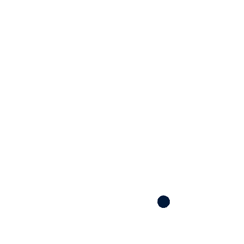

# Projeto Integrador 2025

    
     
     
    

# **Descrição**
Com base no tema gerador proposto no Projeto Integrador 2025: "Fronteiras da Inovação: Intersecção da Ciência e Tecnologia para desenvolver soluções sustentáveis e inteligentes para os desafios globais" nós, do grupo 2, desenvolvemos o Recicla™ (RCL), um marketplace voltado para o comércio de sucatas e resíduos recicláveis, por conta do cenário atual e da escassez de opções acessíveis para vender esses materiais. O objetivo do Recicla é conectar catadores, cooperativas e pequenos geradores de resíduos a compradores de forma prática, incentivando a reciclagem e promovendo a sustentabilidade.
Confira também nosso artigo.

  

# **Tecnologias e ferramentas**

  

# **Instalação**
## **Pré-requisitos**

